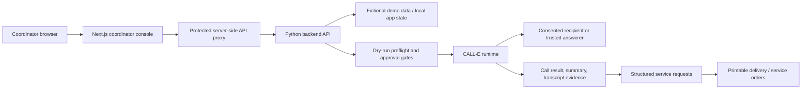
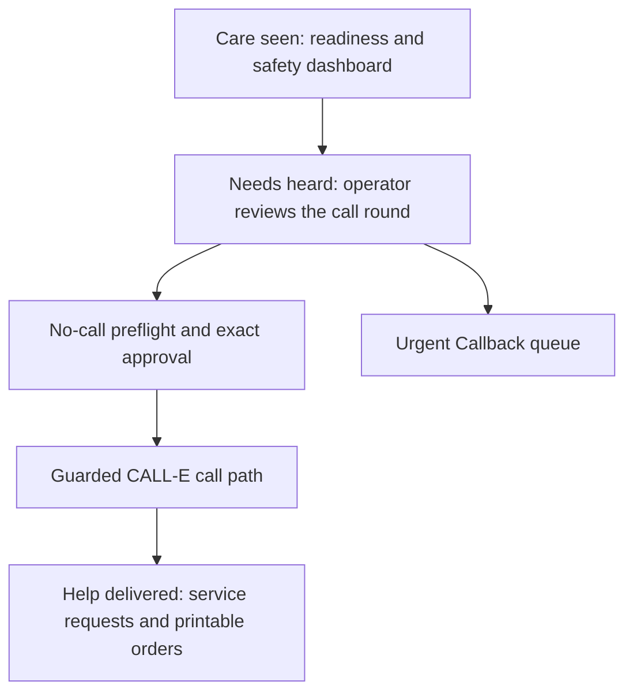

# Care Call AI

Care Call AI is a condition-aware CALL-E app for charities and care support teams.

It helps coordinators safely prepare outreach rounds, run no-call preflight, place a small approved CALL-E batch, and turn phone conversations into practical service requests and printable delivery orders.

## Product Promise

**Care seen. Needs heard. Help delivered.**

- **Care seen** - dashboard statistics show recipient readiness, safety categories, condition mix, and urgent callback pressure.
- **Needs heard** - the operator panel prepares the approved auto-call batch and keeps critical/operator-only recipients out of unattended automation.
- **Help delivered** - call outcomes become structured service requests and printable fulfilment orders.
- **Urgent Callback** - recipient-triggered callback requests appear in a separate priority queue. This is urgent support callback handling, not an emergency medical service.

## Live Demo And Links

- Functional demo app: `<add https://care.alexraixon.com after deployment verification>`
- Demo video: `<add YouTube or Vimeo URL>`
- CALL-E contribution PR: `<add CALLE-AI/awesome-phone-call-agents PR URL>`
- Devpost project: `<add Devpost URL>`
- LinkedIn post: `<add LinkedIn URL>`
- X / Twitter post: `<add X URL>`
- Hackathon Discord post: `<add Discord thread/message URL if available>`

## Architecture





## Why This Exists

Care teams spend a lot of time calling vulnerable people, listening carefully, writing down requests, and routing those requests to delivery, medication, transport, cleaning, laundry, home help, or other support teams.

The phone call is only useful if the person's needs are understood and nothing is lost between the conversation and the actual help being delivered.

Care Call AI uses CALL-E inside a safer workflow:

- recipient safety categories;
- condition-aware call goals;
- trusted answerers;
- no-call preflight;
- exact approval before live calls;
- structured service request generation.

## Screens

- `/dashboard` - Care seen statistics.
- `/dashboard/operator` - Needs heard auto-call round preparation.
- `/dashboard/preflight` - no-call preflight and approval gate.
- `/dashboard/urgent-callback` - priority callback queue.
- `/dashboard/recipients` - recipient cards.
- `/dashboard/orders/print` - Help delivered summary and printable orders.

## Safe Defaults

The project is safe by default:

- tests use fake CALL-E runners;
- dry-run/preflight places zero calls;
- live calls are disabled unless explicitly enabled;
- maximum live batch size is `1`;
- real phones are not committed;
- protected backend calls require a bearer token;
- browser code does not receive backend credentials.

## Local Run

Copy the env example if needed:

```bash
cp .env.example .env.local
```

Start the demo stack:

```bash
make demo-up
```

Open:

```text
http://localhost:3001/dashboard
```

Default local demo login:

```text
operator: carecall-coordinator
password: carecall-demo-password
```

Use port `3001` for the frontend and `8001` for the backend.

## Tests

Run the product gate:

```bash
make test
```

Useful individual checks:

```bash
make backend-test
make frontend-test
make frontend-build
make secrets-check
make final-readiness
make public-export-check
```

## CALL-E Readiness

Safe CALL-E readiness checks:

```bash
calle --help
calle auth status
calle mcp tools
```

The tool list should include planning, running, and retrieving call runs.

Do not run real outbound calls from ad hoc CLI commands. In Care Call AI, real calls must go through the guarded app execution path after preflight and explicit approval.

## Final Real Call

For final approved demos only:

```bash
CARECALL_DEMO_MAX_PHONE=+44... LIVE_DEMO_ACK=EXECUTE_LIVE_CALLS make demo-live-max-up
```

Before using this, complete:

```text
docs/FINAL-DEMO-CHECKLIST.md
```

Stop if consent, answerer identity, route, keyset, or participant comfort is uncertain.

## Hackathon Submission

Project form draft:

```text
docs/HACKATHON-PROJECT-FORM-DRAFT.md
```

CALL-E contribution material:

```text
contribution/awesome-phone-call-agents/
```

Suggested contribution area: `Apps`.

## Public Safety Note

Care Call AI is not a CRM replacement, medical device, emergency service, or clinical decision system. It is a care-intake and service-request workflow that helps coordinators use CALL-E responsibly for approved outreach.
