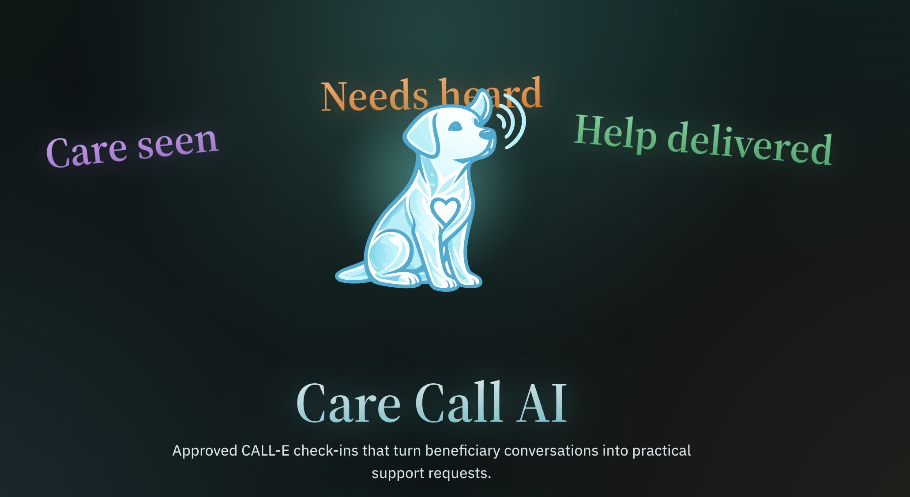

# Care Call AI

**Care seen. Needs heard. Help delivered.**

[](https://github.com/NeoSPU/care-call-ai/actions/workflows/ci.yml)

[](https://about.care.alexraixon.com/)

## Judge Links

- **Live application:** [care.alexraixon.com](https://care.alexraixon.com)
- **Project landing:** [about.care.alexraixon.com](https://about.care.alexraixon.com)
- **Demo video:** [Watch on YouTube](https://youtu.be/Hc2bWjTnKFQ)
- **Public source:** [github.com/NeoSPU/care-call-ai](https://github.com/NeoSPU/care-call-ai)
- **CI results:** [CareCall CI](https://github.com/NeoSPU/care-call-ai/actions/workflows/ci.yml)
- **CALL-E contribution PR:** [CALLE-AI/awesome-phone-call-agents#550](https://github.com/CALLE-AI/awesome-phone-call-agents/pull/550)
- **CALL-E contribution package:** [`contribution/awesome-phone-call-agents/`](contribution/awesome-phone-call-agents/)

The live application is deployed from the private production repository. This
repository is the synchronized, sanitized, runnable hackathon edition used for
technical review.

Care Call AI is a practical support outreach and fulfilment coordination
workflow built with CALL-E. It helps charities, disability support
organizations, and community support services run approved phone check-ins
with beneficiaries and turn completed conversations into practical support
requests and printable fulfilment orders.

The product is built around a simple belief: a care call only matters if the
person's request is heard accurately and becomes an action the team can
complete.

## Product Promise

- **Care seen** - dashboard statistics show recipient readiness, safety
  categories, condition mix, service demand, urgent callback pressure, and
  cases that need human attention.
- **Needs heard** - CALL-E check-ins are prepared from recipient context and
  only started after no-call preflight plus explicit coordinator approval.
- **Help delivered** - completed calls become structured requests, review
  rows, order history, and print-ready handoff sheets.

## Why This Exists

Charities and support organizations spend a lot of time contacting
beneficiaries, listening carefully, writing down everyday requests, and routing
them to food and groceries, medication pickup, transport, cleaning, laundry,
other home help, companionship, leisure activities, repairs, documents support,
or other non-clinical support teams.

The risk is not only that a call is missed. The larger risk is that a person is
heard in the moment, but their request is later delayed, duplicated,
mistranscribed, routed to the wrong team, or forgotten.

Care Call AI uses CALL-E inside a safer coordinator-led workflow:

- recipient safety categories;
- condition-aware call goals;
- trusted answerers;
- no-call preflight;
- exact approval before live calls;
- repeat-call and daily-limit safeguards;
- structured service request generation;
- review states for uncertain, restricted, or no-request outcomes.

## What It Does

Care Call AI lets coordinators:

- review a daily care population before outreach starts;
- identify eligible, blocked, critical, and operator-only recipients;
- inspect and update recipient care cards;
- prepare a CALL-E outreach batch from approved recipient context;
- run preflight without placing calls;
- approve a real CALL-E batch only after explicit confirmation;
- import completed CALL-E results with transcript evidence and summaries;
- extract explicit practical needs without inventing unsupported requests;
- keep review-only and no-request outcomes visible;
- print grouped fulfilment sheets with checkboxes and signoff lines;
- monitor urgent callback requests in a separate queue;
- accept token-protected Siri Shortcut callback requests for registered
  recipients;

## Screens

- `/dashboard` - Care seen statistics.
- `/dashboard/operator` - Needs heard auto-call round preparation.
- `/dashboard/preflight` - no-call preflight and approval gate.
- `/dashboard/recipients` - recipient cards.
- `/dashboard/urgent-callback` - priority callback queue.
- `/dashboard/orders/print` - Help delivered summary and printable orders.
- `/support`, `/privacy`, `/terms` - public support and safety pages.

## Safe Defaults

The project is safe by default:

- tests use fake CALL-E runners;
- no-call preflight places zero calls;
- live calls are disabled unless explicitly enabled;
- maximum live batch size is `1`;
- recipient-triggered callbacks have daily limits;
- repeated recent calls are blocked from unattended automation;
- real phones are not committed;
- protected backend calls require a bearer token;
- browser code does not receive backend, CALL-E, or support
  delivery credentials.

Care Call AI is not a medical, healthcare, clinical, patient-care, or emergency-
response product, and it is not intended for hospitals, medical institutions,
or emergency services. It does not replace clinicians, carers, support workers,
or human coordinators.

## Installation And Local Demo

The judging setup requires only Git, Docker Desktop, and Make. Clone the public
repository and enter it:

```bash
git clone https://github.com/NeoSPU/care-call-ai.git
cd care-call-ai
```

Create the local demo configuration:

```bash
cp .env.example .env.local
```

The supplied file already contains every value required for local review:

```dotenv
CARECALL_OPERATOR_USERNAME=carecall-coordinator
CARECALL_OPERATOR_PASSWORD=carecall-demo-password
CARECALL_AUTH_SECRET=carecall-local-development-secret-not-for-production
CARECALL_BACKEND_API_TOKEN=carecall-local-backend-token
CARECALL_LIVE_CALLS_ENABLED=false
```

These are intentionally public, local-only values. They are not production
credentials. No CALL-E key, assistant token, support-delivery token, Siri token,
external service, or manual secret generation is required for the local demo.
Real outbound calls remain disabled.

Build and start the complete frontend and backend stack:

```bash
make demo-up
```

Verify the local backend:

```bash
make demo-smoke
```

Open [http://localhost:3000](http://localhost:3000) and sign in with:

```text
Username: carecall-coordinator
Password: carecall-demo-password
```

Stop the demo when finished:

```bash
make demo-down
```

## Architecture

The public demo uses a deliberately simple shape:

```text
Next.js frontend
  -> same-origin server routes
  -> protected Python backend
  -> database-backed recipient, call, callback, and order records
  -> guarded CALL-E execution
  -> conservative call-result import
  -> Help delivered orders and printable sheets
```

This repository is a sanitized public hackathon edition. It keeps the working
CALL-E workflow and removes private deployment scripts, internal planning
documents, real participant data, and production-specific infrastructure notes.

## Tests

Run the product gate:

```bash
make test
```

Useful individual checks:

```bash
make backend-test
make frontend-test
make frontend-build
make secrets-check
```

## Siri Callback MVP

Siri through Apple Shortcuts is the verified voice-assistant callback
integration in the current version. A registered and consented recipient can
say `Hey Siri, Raixon Callback` to request a protected CALL-E callback. The
request still passes CareCall's eligibility, daily-limit, run-tracking,
result-import, and human-review controls.

### Configure the recipient token

Generate a different token for each registered recipient:

```bash
openssl rand -base64 48
```

For an optional local callback-intake test, add the token mapping to
`.env.local`, then restart the local demo:

```text
CARECALL_SIRI_CALLBACK_TOKENS=rec-001=<recipient-callback-token>
```

This token is not needed for the normal local judging path. Never commit it or
show it in demo screenshots.

### Build the `Raixon Callback` Shortcut

1. Open Apple Shortcuts on the recipient's iPhone or iPad, tap `+`, and name
   the Shortcut `Raixon Callback`.
2. Add **Get Contents of URL** and set the URL to:

   ```text
   http://<computer-LAN-IP>:3000/api/callback-requests
   ```

3. Expand the action details and select `POST` with a `JSON` request body.
4. Add these headers:

   ```text
   Authorization: Bearer <recipient-callback-token>
   Content-Type: application/json
   ```

5. Add one JSON row per field (do not paste the whole object into one key):

   ```text
   Key: request_text  Type: Text  Value: Please call me back
   Key: locale        Type: Text  Value: en-GB
   Key: device_label  Type: Text  Value: Recipient iPhone
   ```

   Omit `recipient_id`; the server derives it from the bearer token.
6. Add **Get Dictionary Value** for the response field `message`, followed by
   **Speak Text** or **Show Result**.
7. Run the Shortcut once inside Shortcuts and confirm that CareCall accepts the
   request. Then test the phrase `Hey Siri, Raixon Callback`.

After frontend token validation, the protected backend starts an immediate
CALL-E callback for eligible recipients and records the linked run in the
Urgent Callback queue. The MVP default is no more than three automatic
recipient-triggered callbacks per recipient per day. It is not an emergency
medical service.

The Siri Shortcut path is another way to enter the same safety model, not a way
to bypass it.

Siri through Apple Shortcuts is the verified callback integration in the
current version. The platform-specific trigger is separated from the protected
callback endpoint and CALL-E workflow, so planned adapters for Alexa, Google
Assistant, Yandex Alice, and other voice assistants can reuse the same consent,
eligibility, callback-limit, audit, and human-review controls. Those additional
voice-assistant integrations are not currently available.

Siri and Apple Shortcuts are trademarks of Apple Inc. CareCall AI is not
affiliated with or endorsed by Apple.

## Hackathon Submission

CALL-E contribution material:

```text
contribution/awesome-phone-call-agents/
```

Suggested contribution areas:

- `Apps` for the full Care Call AI operator workflow.
- `Agent Skills` for the reusable CareCall intake skill in
  `agent-skills/carecall-intake/SKILL.md`.

## Public Safety Note

Care Call AI is a practical-support outreach and service-request workflow that helps
coordinators use CALL-E responsibly for approved outreach. Critical, blocked,
do-not-call, repeated too recently, and operator-only recipients are excluded
from unattended automatic calling. Unsupported, illegal, unsafe, exploitative,
age-restricted, or region-restricted requests must not become fulfilment
orders.
