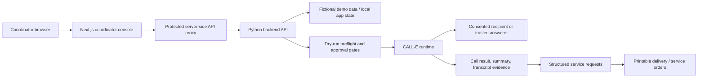
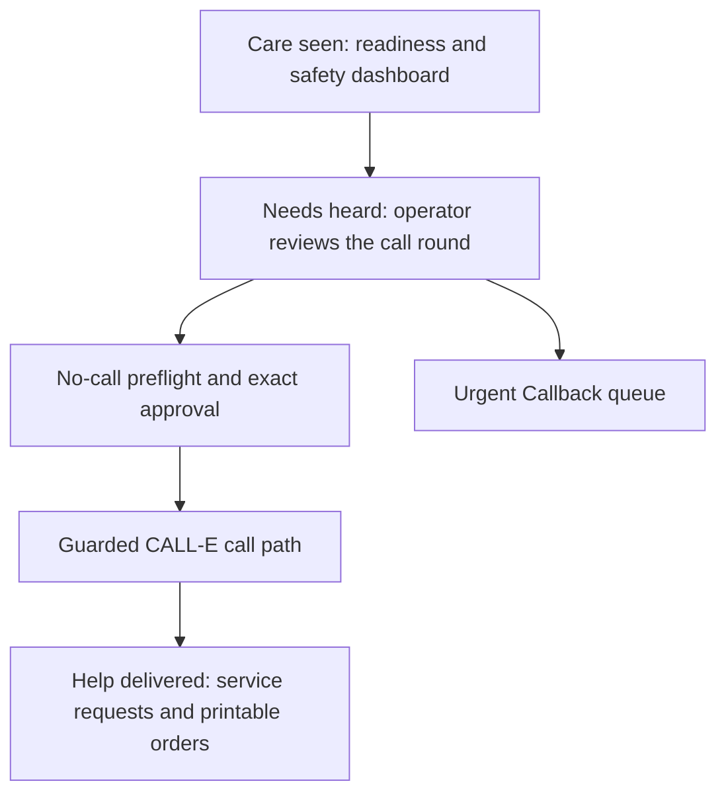

# Care Call AI

Care Call AI is a condition-aware CALL-E app for charities and care support teams.

It helps coordinators safely prepare outreach rounds, run no-call preflight, place a small approved CALL-E batch, and turn phone conversations into practical service requests and printable delivery orders.

## Product Promise

**Care seen. Needs heard. Help delivered.**

- **Care seen** - dashboard statistics show recipient readiness, safety categories, condition mix, and urgent callback pressure.
- **Needs heard** - the operator panel prepares the approved auto-call batch and keeps critical/operator-only recipients out of unattended automation.
- **Help delivered** - call outcomes become structured service requests and printable fulfilment orders.
- **Urgent Callback** - recipient-triggered callback requests appear in a separate priority queue. This is urgent support callback handling, not an emergency medical service.

## Live Demo And Links

- Functional demo app: `<add https://care.alexraixon.com after deployment verification>`
- Demo video: `<add YouTube or Vimeo URL>`
- CALL-E contribution PR: `<add CALLE-AI/awesome-phone-call-agents PR URL>`
- Devpost project: `<add Devpost URL>`
- LinkedIn post: `<add LinkedIn URL>`
- X / Twitter post: `<add X URL>`
- Hackathon Discord post: `<add Discord thread/message URL if available>`

## Architecture





## Why This Exists

Care teams spend a lot of time calling vulnerable people, listening carefully, writing down requests, and routing those requests to delivery, medication, transport, cleaning, laundry, home help, or other support teams.

The phone call is only useful if the person's needs are understood and nothing is lost between the conversation and the actual help being delivered.

Care Call AI uses CALL-E inside a safer workflow:

- recipient safety categories;
- condition-aware call goals;
- trusted answerers;
- no-call preflight;
- exact approval before live calls;
- structured service request generation.

## Screens

- `/dashboard` - Care seen statistics.
- `/dashboard/operator` - Needs heard auto-call round preparation.
- `/dashboard/preflight` - no-call preflight and approval gate.
- `/dashboard/urgent-callback` - priority callback queue.
- `/dashboard/recipients` - recipient cards.
- `/dashboard/orders/print` - Help delivered summary and printable orders.

## Safe Defaults

The project is safe by default:

- tests use fake CALL-E runners;
- dry-run/preflight places zero calls;
- live calls are disabled unless explicitly enabled;
- maximum live batch size is `1`;
- real phones are not committed;
- protected backend calls require a bearer token;
- browser code does not receive backend credentials.

## One-Time Configuration

Docker Compose reads `.env` automatically. Create it once:

```bash
cp .env.example .env
```

For a safe dry-run demo, the defaults are enough. For a real approved CALL-E
demo, fill these values in `.env` before starting the stack:

```text
CARECALL_BACKEND_API_TOKEN=...
CARECALL_OPERATOR_USERNAME=carecall-coordinator
CARECALL_OPERATOR_PASSWORD=...
CARECALL_AUTH_SECRET=...
CARECALL_LIVE_CALLS_ENABLED=true
CARECALL_MAX_LIVE_BATCH_SIZE=1
CARECALL_DEMO_MAX_PHONE=+44...
CARECALL_CALLE_PROVIDER=mcp_http
CARECALL_CALLE_MCP_SERVER_URL=https://seleven-mcp-sg.airudder.com/mcp/openagent_oauth
CARECALL_CALLE_AUTH_TOKEN=...
CARECALL_CALLE_REGION=GB
```

`CARECALL_CALLE_AUTH_TOKEN` is a backend-only CALL-E credential. Do not expose
it to browser code and do not commit `.env`.

## Local Run

Terminal 1 - start the backend API in Docker:

```bash
make demo-up
```

Terminal 2 - start the frontend locally:

```bash
npm --prefix frontend install
python3 scripts/run_frontend_from_env.py
```

Open:

```text
http://localhost:3000/dashboard
```

Login uses the values from `.env`. With the sample file:

```text
operator: carecall-coordinator
password: carecall-demo-password
```

Use port `3000` for the local frontend and `8000` for the Docker backend.

## Clean-Room Live-Call Verification

Use this flow when you want to verify the full public repository path from a
fresh checkout: backend in Docker, frontend running locally, and one real
CALL-E call started only through the frontend approval UI.

Prerequisites:

- Docker Desktop is running.
- Node.js and npm are installed.
- You have a CALL-E account and a backend CALL-E MCP auth token.
- You have consent or an approved outreach basis for the test phone number.

### 1. Clone

```bash
git clone https://github.com/NeoSPU/care-call-ai.git
cd care-call-ai
```

### 2. Create `.env`

```bash
cp .env.example .env
```

Open `.env` in your editor and fill the values there. Do not paste secrets into
terminal prompts and do not export them in shell history.

```bash
nano .env
```

For a real live-call verification, `.env` must contain:

```text
CARECALL_BACKEND_API_TOKEN=<long random backend bearer token>
CARECALL_OPERATOR_USERNAME=carecall-coordinator
CARECALL_OPERATOR_PASSWORD=<operator login password>
CARECALL_AUTH_SECRET=<long random frontend session signing secret>
CARECALL_API_BASE_URL=http://127.0.0.1:8000
CARECALL_LIVE_CALLS_ENABLED=true
CARECALL_MAX_LIVE_BATCH_SIZE=1
CARECALL_DEMO_MAX_PHONE=<approved E.164 test phone, for example +44...>
CARECALL_CALLE_PROVIDER=mcp_http
CARECALL_CALLE_MCP_SERVER_URL=https://seleven-mcp-sg.airudder.com/mcp/openagent_oauth
CARECALL_CALLE_AUTH_TOKEN=<backend-only CALL-E MCP auth token>
CARECALL_CALLE_REGION=GB
CARECALL_CALLE_TIMEOUT_SECONDS=45
```

You can generate non-CALL-E local secrets and copy them into `.env`:

```bash
openssl rand -hex 32
```

Check that `.env` exists and is ignored by git:

```bash
test -f .env
git check-ignore .env
```

The second command should print `.env`.

### 3. Start Backend In Docker

Use one terminal for the backend:

```bash
make demo-up
```

In a second terminal, verify the backend. This reads the bearer token from
`.env` and does not print it:

```bash
cd care-call-ai
curl -fsS http://127.0.0.1:8000/health
python3 - <<'PY'
from pathlib import Path
import json
import urllib.request

env = {}
for line in Path(".env").read_text().splitlines():
    if "=" in line and not line.lstrip().startswith("#"):
        key, value = line.split("=", 1)
        env[key] = value

request = urllib.request.Request(
    "http://127.0.0.1:8000/api/dashboard",
    headers={"Authorization": "Bearer " + env["CARECALL_BACKEND_API_TOKEN"]},
)
with urllib.request.urlopen(request, timeout=10) as response:
    payload = json.loads(response.read().decode("utf-8"))
print(json.dumps(payload["summary"], indent=2))
PY
```

### 4. Start Frontend Locally

Use another terminal for the frontend:

```bash
cd care-call-ai
npm --prefix frontend install
python3 scripts/run_frontend_from_env.py
```

Open:

```text
http://127.0.0.1:3000/dashboard
```

Use the operator username and password you placed in `.env`.

Do not authorize real calls in the terminal. The only live-call authorization is
inside the frontend: four checkboxes plus the exact phrase.

### 5. Place One Real CALL-E Call From The UI

Do not call backend execution endpoints manually and do not authorize calls in
the terminal. Use the app:

1. Log in.
2. Open `/dashboard/operator`.
3. Select exactly one eligible recipient. For the live smoke test, use the
   runtime `Max Neous` card injected by `CARECALL_DEMO_MAX_PHONE`.
4. Click the button that opens/runs preflight.
5. On `/dashboard/preflight`, confirm the list contains exactly one ready call.
6. Run dry run first. It must report `0` real calls placed.
7. Switch to live mode.
8. Check all four live confirmations.
9. Type exactly:

   ```text
   EXECUTE LIVE CALLS
   ```

10. Start the live round from the frontend button.
11. Wait for the CALL-E call to finish.
12. Click `Import latest CALL-E result`.
13. Open `/dashboard/orders/print` to verify whether service requests/orders
    were created from the imported result.

### 6. Stop The Local Verification Stack

```bash
make demo-down
```

Stop the local frontend terminal with `Ctrl-C`.

## Live CALL-E Flow

Real calls are started only from the app:

1. Open `/dashboard/operator`.
2. Select exactly one approved, non-critical recipient.
3. Run preflight.
4. On `/dashboard/preflight`, switch to live mode.
5. Check all four confirmations.
6. Type the exact phrase `EXECUTE LIVE CALLS`.
7. Click the live start button.
8. After the call reaches a terminal CALL-E status, click `Import latest CALL-E result`.

Do not run real outbound calls from ad hoc terminal commands. The terminal is
only for one-time `.env` setup and starting the app.

## Tests

Run the product gate:

```bash
make test
```

Useful individual checks:

```bash
make backend-test
make frontend-test
make frontend-build
make secrets-check
make final-readiness
```

## Final Real Call Safety

Before any real call, complete:

```text
docs/FINAL-DEMO-CHECKLIST.md
```

Stop if consent, answerer identity, route, keyset, or participant comfort is uncertain.

## Hackathon Submission

Project form draft:

```text
docs/HACKATHON-PROJECT-FORM-DRAFT.md
```

CALL-E contribution material:

```text
contribution/awesome-phone-call-agents/
```

Suggested contribution area: `Apps`.

## Public Safety Note

Care Call AI is not a CRM replacement, medical device, emergency service, or clinical decision system. It is a care-intake and service-request workflow that helps coordinators use CALL-E responsibly for approved outreach.
